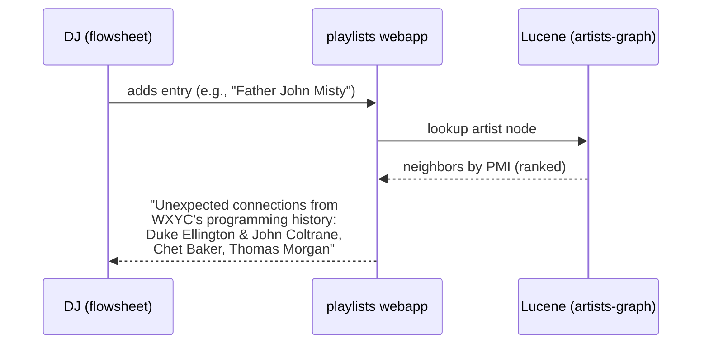
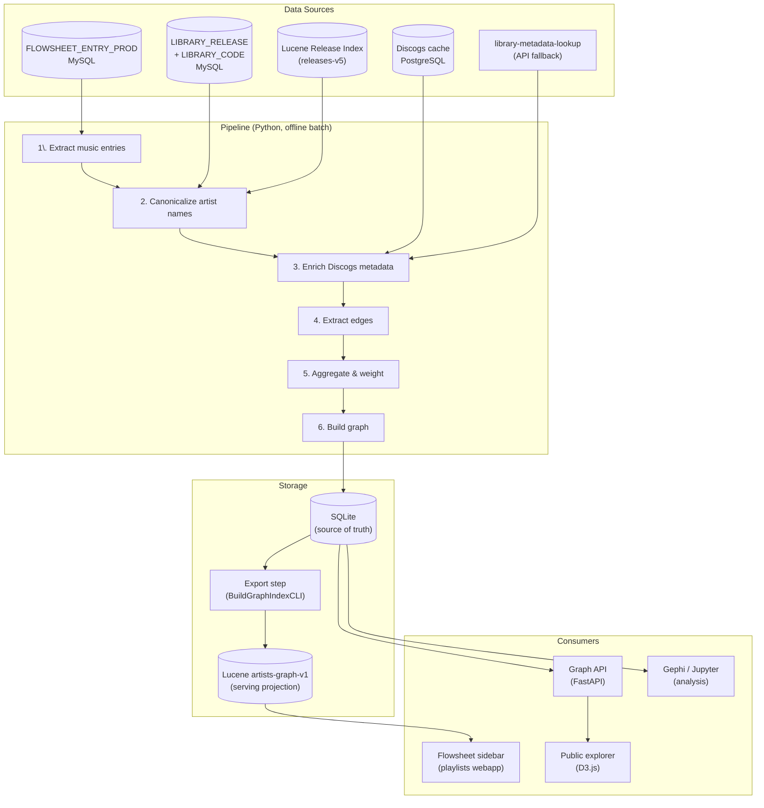
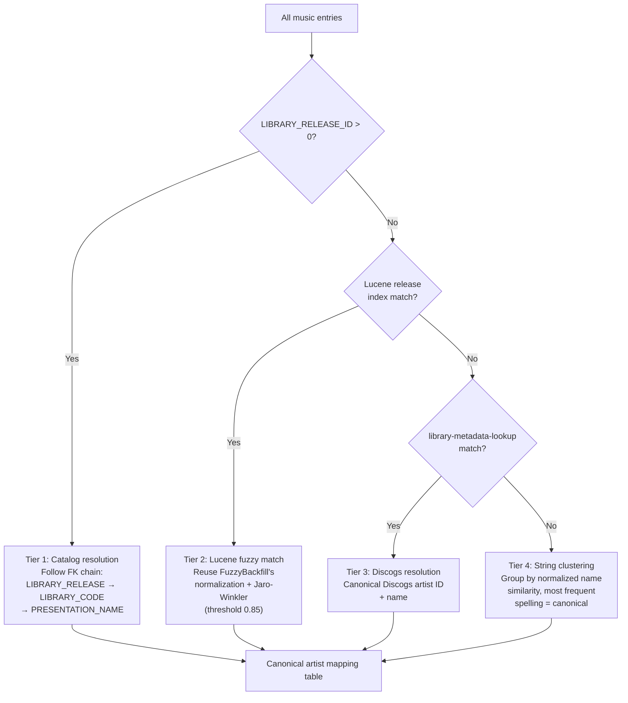
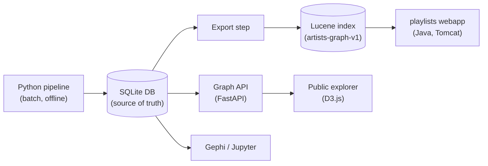

# Proposal: WXYC Semantic Index

## Context

WXYC's flowsheet database contains 22 years of continuous playlist data (2004-present), logged track-by-track by DJs during their shows. Each entry captures what was played, when, by whom, and in what sequence. The library catalog holds ~72,000 physical releases classified by genre, artist, and format. The Discogs cache adds structured metadata (styles, personnel, label lineage) for releases that can be cross-referenced.

This data encodes something that doesn't exist anywhere else: the curatorial decisions of hundreds of freeform radio DJs over two decades. Every time a DJ follows one track with another, they're making an implicit editorial statement about musical relationships. Aggregated across millions of entries, these decisions form a semantic web of musical connections that reflects how humans actually think about music — not by genre taxonomy, but by sonic texture, mood, cultural lineage, and associative intuition.

This proposal describes a system for extracting, structuring, and serving that semantic web.

## Semantic Relationships

In a real WXYC show from the fixture data, a DJ follows Father John Misty's "Chateau Lobby #4" with Duke Ellington & John Coltrane's "In a Sentimental Mood." Indie folk-rock into 1963 jazz — no genre taxonomy connects them. But the DJ heard two ballads with the same aching intimacy and made a programming decision that a genre-based system would never suggest. In the same show, Buck Meek (4AD indie rock) leads into Thomas Morgan (contemporary jazz bass) leads into Superchunk (Merge punk). In another show, Anne Gillis (French industrial noise on Art into Life) is followed by Large Professor's "Stay Chisel" (boom-bap hip-hop on Matador). Gary Higgins (obscure 1970s psych-folk) flows into Mamehy (Malagasy tsapiky from Sublime Frequencies).

These aren't accidents. WXYC's mission is to connect seemingly disparate sounds across time and space. When the semantic index surfaces the *obvious* neighbors — Stereolab → Broadcast, Tortoise → Sea and Cake — it's telling you what you already know. The real value is further down the list: the 3rd or 5th most common transition, the cross-genre edges that no metadata system would predict but that multiple DJs independently made. Like an LLM sampling with high temperature, the most interesting output isn't the highest-probability next token — it's the surprising-but-plausible one that reveals a connection one DJ intuited but that no metadata system would have surfaced.

The index is a multi-relational graph. Nodes are canonical artists. Edges connect artists through different types of relationships, each derived from a different data source.

| Data Source | Relationship Type | Signal |
|------------|-------------------|--------|
| Flowsheet sequence | **DJ Transition** | Adjacent plays within a show |
| Discogs credits | **Shared Personnel** | Same musician on both records |
| Discogs styles | **Shared Style** | Overlapping style tags |
| Discogs labels + WXYC `COMPANY` | **Label Family** | Same label or parent label |
| Discogs tracklists | **Compilation Co-appearance** | Both on same compilation |
| WXYC cross-reference tables | **Cross-Reference** | Catalog-linked collaborations |

## What We Can Do With It

### Product surfaces

**DJ flowsheet integration** — When a DJ adds an entry to the flowsheet, a sidebar shows related artists based on the co-occurrence graph. Rather than showing only the most obvious neighbors (which the DJ likely already knows), the display can sample from deeper in the ranked list — surfacing the surprising cross-genre connections that other DJs have made. This is a discovery engine, not a recommendation engine. It doesn't prescribe what to play — that would undermine freeform radio — but it reveals connections across the station's collective programming history that an individual DJ might never encounter.



**Public graph explorer** — An interactive web-based visualization on wxyc.org. Type an artist name, see their neighborhood as a [force-directed graph](https://en.wikipedia.org/wiki/Force-directed_graph_drawing) (a layout where connected nodes attract and unconnected nodes repel, forming natural clusters). Click a node to re-center. Color by genre, edge thickness by PMI, filter by edge type. The most interesting view is the cross-genre filter: show only neighbors in a different genre, revealing the unexpected bridges in WXYC's programming.

Implementation: D3.js force simulation, fed by the graph API. Lightweight — the API does all the heavy lifting, the frontend just renders neighborhoods on demand.

**Graph API** — A lightweight FastAPI service in the `semantic-index` repo, serving the SQLite graph database.

```
GET  /graph/artists/{id}/neighbors?type=djTransition&limit=20
GET  /graph/artists/search?q=autechre
GET  /graph/artists/{id}/path/{target_id}?max_hops=4
GET  /graph/artists/{id}/explain/{target_id}
GET  /graph/clusters
GET  /graph/bridges?between=jazz&and=electronic
```

The `/explain` endpoint is the most compelling: given two seemingly unrelated artists, return all relationship types connecting them — "Father John Misty and Duke Ellington & John Coltrane: played adjacently by 3 DJs over 5 years, no shared personnel, no shared labels, no shared Discogs styles — connected purely through curatorial intuition."

**Analytical reports** — Periodic batch outputs from the Python pipeline:

- **Community detection** — [Louvain](https://en.wikipedia.org/wiki/Louvain_method) clusters (an algorithm that finds groups of densely connected nodes) compared to official genres. Where do they agree? Where do they diverge? If "dub reggae + Krautrock + ambient" consistently clusters together despite being three separate WXYC genres, that's a real finding.
- **Temporal evolution** — How the graph changes year-over-year. Which edges appeared? Disappeared? Which artists gained centrality?
- **New release placement** — When a release enters rotation, find its nearest neighbors by Discogs style/personnel similarity. "This new Drag City release is stylistically closest to these 5 artists that WXYC already plays heavily."
- **DJ taste profiles** — Per-DJ embeddings derived from their play history. Which DJs are most adventurous? Which are genre-focused? Which DJs' tastes overlap?

### Validation tools

These are for development and pipeline validation, not end-user facing.

**[Gephi](https://gephi.org/)** (desktop graph visualization) — The first tool to reach for. Export the graph from the Python pipeline as [GEXF](https://gexf.net/) (Graph Exchange XML Format) or GraphML, open in Gephi, run [Force Atlas 2](https://journals.plos.org/plosone/article?id=10.1371/journal.pone.0098679) layout (a physics simulation that pulls connected nodes together and pushes unconnected nodes apart). Gephi handles 30K nodes and lets you interactively filter by edge type, color by genre, size by play count, and explore clusters. This is where you validate that the graph captures real structure before building any product surfaces.

Use cases:
- Identify emergent genre clusters and compare to WXYC's 16 official genres
- Find bridge artists (high [betweenness centrality](https://en.wikipedia.org/wiki/Betweenness_centrality) — nodes that sit on many shortest paths between other nodes) that connect disparate clusters
- Spot anomalies — artists with unexpected connections that reveal curatorial insights
- Generate publication-quality visualizations for the station's public communications

**[NetworkX](https://networkx.org/) + Jupyter** (analytical exploration) — For quantitative analysis during pipeline development:
- [Degree distributions](https://en.wikipedia.org/wiki/Degree_distribution) (how many connections each node has), [connected components](https://en.wikipedia.org/wiki/Component_(graph_theory)) (isolated subgraphs), graph density
- Community detection ([Louvain algorithm](https://en.wikipedia.org/wiki/Louvain_method))
- Centrality metrics ([betweenness](https://en.wikipedia.org/wiki/Betweenness_centrality), [PageRank](https://en.wikipedia.org/wiki/PageRank), [eigenvector](https://en.wikipedia.org/wiki/Eigenvector_centrality))
- Temporal snapshots — rebuild the graph per-year and diff

## Roadmap

### Near-term (gated on Phase 3)

- **Public graph explorer** — D3.js force-directed visualization on wxyc.org. D3.js preferred over Sigma.js for flexibility; Sigma.js remains an option if performance is an issue at scale.
- **Incremental pipeline updates** — Add new flowsheet entries to the graph without full pipeline re-runs.
- **DJ taste profiles** — Per-DJ embeddings from play history. Which DJs are most adventurous? Which DJs' tastes overlap?
- **Temporal analysis** — How the graph evolves year-over-year. Which edges appeared? Disappeared?
- **`/graph/clusters` and `/graph/bridges` endpoints** — Precomputed community structure and cross-genre bridge artists.

### Future data source: Digitized album reviews

WXYC's physical library contains handwritten reviews pasted onto album covers — music directors' notes written at the moment a release entered the collection. A parallel digitization effort (image capture → OCR → text) is producing machine-readable review text linked to library releases by call number. This data encodes something no other source captures: explicit curatorial reasoning about *why* a release matters, in the reviewer's own words.

#### What the review text contains

Unlike flowsheet data (behavioral, implicit) or Discogs metadata (structured, external), reviews are **unstructured first-person curatorial judgments**. They typically include:

- **Sonic descriptors** — Informal vocabulary that doesn't map to any genre taxonomy: "skittery," "lush," "angular," "kosmische," "zonked-out." This is how the station actually talks about music, unconstrained by Discogs' controlled tag set.
- **Comparative references** — "Sounds like Broadcast meets Burial," "for fans of Tortoise," "imagine if Stereolab made a dub record." These are explicit artist-to-artist connections made by a knowledgeable listener.
- **Enthusiasm and context** — "Absolutely essential, best thing on Drag City this year" vs. "decent, standard indie rock." Sentiment carries weight — not all rotation adds are equal.
- **Temporal voice** — How the station's critical vocabulary evolves across decades. When do terms like "vaporwave" or "hyperpop" first appear in reviews?

#### New edge types

**Review Comparison** — When a review references another artist ("sounds like X," "Tortoise vibes," "imagine if Y made a Z record"), that's a directed edge from the reviewed artist to the referenced artist. This edge type is distinct from DJ transitions: it captures *conscious curatorial reasoning* rather than implicit behavioral patterns. A music director writing "sounds like Stereolab" is a stronger, more interpretable signal than two adjacent flowsheet plays.

| Attribute | Value |
|-----------|-------|
| **Weight** | Confidence of reference extraction (explicit "sounds like" > implicit mention) |
| **Metadata** | Context snippet from the review, reviewer identity if available, review date |
| **Direction** | Reviewed artist → referenced artist |

**Shared Review Language** — Artists whose reviews use the same sonic vocabulary — not because DJs play them together, but because reviewers *describe* them the same way. Derived by embedding extracted sonic descriptors and computing cosine similarity between artists' descriptor vectors. Two artists both described as "angular post-punk with kosmische undertones" are connected even if they've never appeared in the same flowsheet show.

| Attribute | Value |
|-----------|-------|
| **Weight** | Cosine similarity of descriptor embeddings |
| **Metadata** | Overlapping descriptors, representative review snippets |

#### New node attributes from reviews

| Attribute | Derivation | Semantic value |
|-----------|------------|----------------|
| Sonic descriptors | Keyword extraction from review text | WXYC-native style vocabulary, more expressive than Discogs tags |
| Sentiment score | Sentiment analysis on review text | Enthusiasm level at time of acquisition |
| Review descriptor embedding | Sentence transformer on extracted descriptors | Embedding-space clustering by aesthetic similarity |

#### Analyses

**Enthusiasm vs. airplay correlation** — Do releases with enthusiastic reviews get more plays? Which music directors' taste best predicts DJ adoption? This validates (or challenges) the assumption that rotation adds reflect station-wide consensus.

**Sonic vocabulary evolution** — How the station's critical language changes over decades. Track when descriptors emerge, peak, and fade. This is cultural history with concrete timestamps.

**Graph validation** — Explicit "sounds like X" comparisons serve as ground truth for DJ transition edges. If the PMI-weighted graph says Artist A and Artist B are closely related, and a review of Artist A also references Artist B, that's independent confirmation. Conversely, review references the graph misses reveal gaps in the flowsheet signal.

#### Pipeline integration

The digitization pipeline produces text linked to a library release (by call number or barcode scan). Integration with the semantic index pipeline:

1. **Extract artist references** — NER and pattern matching (`"sounds like X"`, `"for fans of X"`, `"X meets Y"`) on review text
2. **Resolve referenced artists** — Against the canonical artist mapping table (same Tier 1-4 process as flowsheet entries)
3. **Extract sonic descriptors** — Keyword extraction or a fine-tuned classifier on the informal vocabulary
4. **Compute descriptor embeddings** — Sentence transformer on per-artist descriptor sets
5. **Store** — New tables in the SQLite graph database:

**`review`** — One row per digitized review.

| Column | Type | Notes |
|--------|------|-------|
| `id` | int | PK |
| `artist_id` | int | FK → artist |
| `release_id` | int | nullable, FK → library release |
| `text` | text | Full review text |
| `sentiment_score` | float | nullable |
| `reviewer` | text | nullable (if identifiable) |
| `review_date` | text | nullable (if identifiable) |

**`review_comparison`** — Directed edges from explicit artist references in reviews.

| Column | Type | Notes |
|--------|------|-------|
| `reviewed_artist_id` | int | FK → artist |
| `referenced_artist_id` | int | FK → artist |
| `review_id` | int | FK → review |
| `context_snippet` | text | Surrounding text of the reference |
| `confidence` | float | Extraction confidence |

**`artist_descriptor`** — Sonic vocabulary per artist, extracted from reviews.

| Column | Type | Notes |
|--------|------|-------|
| `artist_id` | int | FK → artist |
| `descriptor` | text | e.g., "angular," "lush," "kosmische" |
| `occurrence_count` | int | Across all reviews for this artist |

#### Phasing

This work is gated on the digitization effort producing linked, OCR'd text. It does not block any phase of the semantic index pipeline — the review edge types and node attributes are additive. When review data becomes available, it slots into the existing pipeline between Step 3 (Discogs enrichment) and Step 4 (edge extraction) as a parallel enrichment source.

### Future data source: Wikidata

[Wikidata](https://www.wikidata.org/) is a free, structured knowledge graph maintained by the Wikimedia Foundation. It contains ~1M music artist entities with machine-readable properties including genres, instruments, record labels, country of origin, active years, and — most valuably — **influence relationships**: `influenced by` (P737) and its inverse. These are musicological claims sourced from interviews, liner notes, and critical writing, curated by the Wikidata community under a CC0 (public domain) license.

#### What it uniquely contributes

Discogs captures structural relationships (who played on what record, who released on what label). Wikidata captures **musicological relationships** — documented influence, association, and lineage that exist independent of any recording or label. A Discogs edge says "these two artists share a producer." A Wikidata edge says "this artist cited that artist as a primary influence in a 1998 interview."

#### New edge type: Documented Influence

A directed edge from artist A to artist B when Wikidata records that A was influenced by B (or that B influenced A). This is the academic/musicological counterpart to the DJ transition edge — one is empirical (DJs program them together), the other is documented (critics and artists say the influence exists).

| Attribute | Value |
|-----------|-------|
| **Weight** | Binary (documented or not), optionally enriched with reference count |
| **Metadata** | Wikidata reference sources (interviews, biographies, liner notes) |
| **Direction** | Influenced artist → influencing artist |

Comparing documented influence edges against PMI-weighted DJ transition edges is a genuine research question: do WXYC DJs intuitively program along documented influence lines, or do they find connections that the musicological record doesn't capture? Both outcomes are interesting — agreement validates the graph, divergence reveals the unique curatorial knowledge that freeform radio produces.

#### Additional node attributes from Wikidata

| Attribute | Wikidata property | Semantic value |
|-----------|------------------|----------------|
| Country of origin | P495, P27 | Geographic dimension for the graph |
| Instruments | P1303 | Sonic profile (guitar-based, electronic, brass-heavy) |
| Associated acts | P527, P361 | Side projects, supergroups, collaborations |
| Awards | P166 | Critical recognition |
| Active years | P2031, P2032 | Temporal context independent of WXYC play history |

#### Integration

Wikidata entities link to MusicBrainz via property P434 (MusicBrainz artist ID), and Discogs via P1953 (Discogs artist ID). Matching canonical artists in the semantic index to Wikidata entities can use these cross-references or fall back to name matching. The SPARQL endpoint is free and unlimited; the full dump is also available for bulk processing.

This enrichment is additive — it does not block any phase and can be integrated whenever capacity allows. The influence edges are the highest-value addition; the node attributes are supplementary.

### Future data source: MusicBrainz

[MusicBrainz](https://musicbrainz.org/) is an open music encyclopedia with a community-maintained relational database of artists, recordings, releases, and — critically — over 50 typed relationships between entities. The core data is CC0 (public domain); supplementary data (tags, ratings) is CC BY-NC-SA. A full PostgreSQL dump is published weekly.

#### What it uniquely contributes

Discogs has personnel credits (who played on a record) and label data. MusicBrainz has a richer relationship ontology that captures connections Discogs doesn't model:

| Relationship type | Example | Discogs equivalent |
|---|---|---|
| `member of band` | Thom Yorke → Radiohead | Partial (artist credits) |
| `collaboration` | Burial + Four Tet | Not modeled |
| `remix` | Four Tet remixed Radiohead | Partial (track credits) |
| `cover` | Cat Power covered "(I Can't Get No) Satisfaction" | Not modeled |
| `tribute` | Dub Side of the Moon (tribute to Pink Floyd) | Not modeled |
| `DJ mix` | DJ Shadow mixed "Endtroducing....." | Not modeled |
| `composer` / `lyricist` | Distinct from performer credits | Partial |
| `recording engineer` / `mastering` | More granular roles than Discogs | Overlapping |

These typed relationships produce more specific edges than Discogs' flat credits list. "Artist A remixed Artist B" is a different kind of connection than "Artist A and Artist B share a mastering engineer."

#### New edge type: MusicBrainz Typed Relationship

Edges derived from MusicBrainz's Advanced Relationship system, preserving the relationship type as metadata. Unlike the Discogs "shared personnel" edge (which collapses all credit types), these edges retain semantic specificity.

| Attribute | Value |
|-----------|-------|
| **Weight** | Count of relationships between the pair |
| **Metadata** | Relationship types (member, remix, cover, collaboration, etc.) |
| **Direction** | Depends on relationship type (remix is directed, collaboration is undirected) |

#### Coverage and Discogs overlap

MusicBrainz and Discogs overlap substantially on basic release metadata and personnel credits. The value of adding MusicBrainz is in the typed relationships that Discogs doesn't model and in coverage gaps — MusicBrainz tends to have better coverage for digital-only releases and recent independent music, while Discogs is stronger for physical releases and older catalog. For WXYC's physical-only library, Discogs is likely the primary source, but MusicBrainz fills gaps for artists who are well-documented in MusicBrainz but sparse in Discogs.

#### Integration

MusicBrainz IDs are the standard cross-reference key in the open music data ecosystem. Wikidata links to MusicBrainz via P434, and Discogs artist IDs can be matched via MusicBrainz's URL relationships. The weekly PostgreSQL dump can be loaded into a local database for bulk processing, following the same pattern as the Discogs cache.

Like Wikidata, this enrichment is additive and can be integrated whenever capacity allows. The typed relationships are the highest-value addition; the metadata overlap with Discogs is secondary.

## Data Inventory

This section catalogs the raw attributes available for building the graph. It serves as a reference for pipeline implementation — the semantic relationships and product surfaces described above are derived from these sources.

### WXYC Data Sources

#### Flowsheet entries (`FLOWSHEET_ENTRY_PROD`)

The primary signal source and the foundation of the entire graph. Every DJ transition edge is derived from the sequence of entries within a show. ~1-2M rows spanning 2004 to present.

| Attribute | Column | Semantic value |
|-----------|--------|----------------|
| Artist name | `ARTIST_NAME` | Free-text as typed by DJ (requires canonicalization) |
| Song title | `SONG_TITLE` | Track-level granularity |
| Release title | `RELEASE_TITLE` | Album-level grouping |
| Label | `LABEL_NAME` | Curatorial/distribution lineage |
| Sequence | `SEQUENCE_WITHIN_SHOW` | Adjacency = implicit association |
| Show | `RADIO_SHOW_ID` | Groups entries by DJ session |
| Timestamp | `RADIO_HOUR`, `START_TIME` | Temporal patterns (time of day, season, era) |
| Entry type | `FLOWSHEET_ENTRY_TYPE_CODE_ID` | Rotation status (H/M/L/S) vs. regular play |
| Request flag | `REQUEST_FLAG` | Listener demand signal |
| Library link | `LIBRARY_RELEASE_ID` | Connection to canonical catalog (0 = unresolved) |
| Rotation link | `ROTATION_RELEASE_ID` | Connection to rotation system |
| Format | `RELEASE_FORMAT_ID` | Physical medium (CD, vinyl, 7", LP, etc.) |

#### Radio shows (`FLOWSHEET_RADIO_SHOW_PROD`)

Show boundaries define where DJ transition edges start and stop. DJ identity enables per-DJ analysis (taste profiles, affinity scores).

| Attribute | Column | Semantic value |
|-----------|--------|----------------|
| DJ identity | `DJ_ID`, `DJ_NAME`, `DJ_HANDLE` | Who made the curatorial decision |
| Specialty show | `SHOW_NAME`, `SPECIALTY_SHOW_ID` | Named programming contexts (e.g., "Friday Night Jazz") |
| Show duration | `SIGNON_TIME`, `SIGNOFF_TIME` | Programming window |

#### Library catalog (`LIBRARY_RELEASE` + `LIBRARY_CODE` + `GENRE`)

The catalog provides canonical artist identities (resolving the many spellings DJs type into a single node) and the station's 16-genre classification. It's the primary input to Tier 1 canonicalization. ~72K releases, ~18K library codes.

| Attribute | Tables | Semantic value |
|-----------|--------|----------------|
| Canonical artist | `LIBRARY_CODE.PRESENTATION_NAME` | Deduplicated artist identity |
| Genre | `GENRE.REFERENCE_NAME` | 16 coarse genre categories |
| Call number | `LIBRARY_CODE.CALL_LETTERS` + `CALL_NUMBERS` | Station-specific classification |
| Format | `FORMAT.REFERENCE_NAME` | Physical medium |
| Cross-references | `LIBRARY_CODE_CROSS_REFERENCE`, `RELEASE_CROSS_REFERENCE` | Known collaborations, compilation appearances |

#### Rotation system (`ROTATION_RELEASE` + `WEEKLY_PLAY`)

Rotation data feeds node attributes (rotation history, airplay velocity) and contributes to label family edges via the `COMPANY` table. Secondary to the flowsheet and catalog but adds useful context about how the station prioritizes new music.

| Attribute | Tables | Semantic value |
|-----------|--------|----------------|
| Rotation level | `ROTATION_RELEASE.ROTATION_TYPE` | Station priority (H/M/L/S) |
| Add/kill dates | `ROTATION_ADD_DATE`, `ROTATION_KILL_DATE` | Active promotion window |
| Genre flags | `HIP_HOP`, `JAZZ`, `LOUD_ROCK`, `NEW_WORLD`, `RPM` | Sub-genre tagging |
| Weekly plays | `WEEKLY_PLAY.NUMBER_OF_PLAYS` | Airplay velocity |
| Label/distributor | `COMPANY.NAME`, `PARENT_COMPANY_ID` | Label family tree |

### External Data Source: Discogs (via library-metadata-lookup)

Discogs is the source of everything WXYC's schema lacks: granular style tags, personnel credits, label lineage, and compilation tracklists. These feed four of the six edge types (shared personnel, shared style, label family, compilation co-appearance) and enrich node attributes with sub-genre detail far beyond WXYC's 16 genres.

| Attribute | Source | Semantic value |
|-----------|--------|----------------|
| Styles | `ReleaseMetadataResponse.styles` | Granular sub-genre tags ("post-punk", "dub techno", "free jazz") |
| Personnel | `ReleaseMetadataResponse.extra_artists` | Who played on the record, with roles (producer, engineer, sideman) |
| Label credits | `ReleaseMetadataResponse.labels` | Label + catalog number, enabling label family mapping |
| Artist aliases | Artist details endpoint | Name variations, group members, side projects |
| Release year | `ReleaseMetadataResponse.year`, `released` | Temporal context for the music itself (vs. when it was played) |
| Tracklist | `ReleaseMetadataResponse.tracklist` | Per-track artist credits (crucial for compilations) |
| Genres | `ReleaseMetadataResponse.genres` | Discogs genre taxonomy (different granularity than WXYC's) |

The Discogs cache (PostgreSQL, populated by the discogs-cache ETL pipeline) holds the bulk data locally, so most lookups resolve without hitting the Discogs API.

### Derived Attributes

These are computed from the raw data and stored as node attributes in the graph. They characterize each artist's presence within WXYC's programming.

| Attribute | Derivation | Semantic value |
|-----------|------------|----------------|
| Play frequency | Count of entries per artist | Popularity within WXYC's programming |
| Active years | Min/max year of entries per artist | Longevity in rotation |
| DJ affinity | Per-DJ play counts per artist | Which DJs champion which artists |
| Time-of-day profile | Distribution of play timestamps | "Late night music" vs. "morning music" |
| Request ratio | `REQUEST_FLAG` count / total plays | Listener demand vs. DJ initiative |
| Format preference | CD vs. vinyl play ratio over time | Medium evolution |
| Rotation compliance | Rotation entries / total entries per DJ | How closely DJs follow rotation obligations |

## Technical Pipeline

### Architecture Overview



### Graph model

This section specifies the edge types and node attributes that the pipeline produces. Each edge type has a weight (how to rank connections) and metadata (what to display in the UI).

#### Edge types

**DJ Transition** (unique WXYC signal) — When a DJ plays Artist B immediately after Artist A, that's one directed edge `A → B`. Aggregated across all shows:

- **Weight**: [Pointwise mutual information](https://en.wikipedia.org/wiki/Pointwise_mutual_information) (PMI) — measures how much more often two artists appear together than you'd expect by chance, normalizing for base popularity
- **Metadata**: DJ count (how many distinct DJs made this transition), temporal spread (years), directionality
- **PMI formula**: `log2( P(A→B) / (P(A) * P(B)) )` where probabilities are over all transition pairs
- **Self-loops**: Same artist back-to-back (two tracks from one album) — valid signal, kept as edges

**Shared Personnel** (Discogs) — Two artists share a credited musician (sideman, producer, engineer). Derived from `extra_artists` on their respective Discogs releases.

- **Weight**: Number of shared personnel
- **Metadata**: Names and roles of shared musicians

**Shared Style** (Discogs) — Two artists have overlapping Discogs style tags. WXYC's 16 genres are too coarse; Discogs has hundreds of granular styles.

- **Weight**: [Jaccard similarity](https://en.wikipedia.org/wiki/Jaccard_index) of style tag sets (ratio of shared tags to total tags): `|A ∩ B| / |A ∪ B|`
- **Metadata**: The overlapping and non-overlapping tags

**Label Family** (Discogs + WXYC `COMPANY`) — Two artists released music on the same label or on labels with the same parent company.

- **Weight**: Number of shared labels
- **Metadata**: Label names, parent relationships

**Compilation Co-appearance** (Discogs) — Two artists appear on the same compilation release. Discogs tracklist data with per-track artist credits makes this derivable.

- **Weight**: Number of shared compilations
- **Metadata**: Compilation titles

**WXYC Cross-Reference** (catalog) — Existing `LIBRARY_CODE_CROSS_REFERENCE` and `RELEASE_CROSS_REFERENCE` tables encode known collaborations and compilation appearances within the WXYC catalog.

- **Weight**: Binary (linked or not)
- **Metadata**: Comment field describing the relationship

#### Node attributes

Each artist node carries a feature vector:

| Attribute | Source | Type |
|-----------|--------|------|
| Canonical name | `LIBRARY_CODE.PRESENTATION_NAME` or Discogs | string |
| Aliases | Aggregated `ARTIST_NAME` variants from flowsheet | string[] |
| WXYC genre | `GENRE.REFERENCE_NAME` | string |
| Discogs styles | Discogs release metadata | string[] |
| Total plays | Count of flowsheet entries | int |
| Active years | Min/max year of flowsheet entries | range |
| DJ count | Distinct DJs who played this artist | int |
| Request ratio | Requested plays / total plays | float |
| Time-of-day profile | Histogram of play hours (0-23) | float[24] |
| Format distribution | CD vs. vinyl vs. other play ratios | map |
| Rotation history | Rotation levels and durations | struct[] |

### Step 1: Extract music entries

Query `FLOWSHEET_ENTRY_PROD` for all indexable music entries (type codes 0-6), joined to `FLOWSHEET_RADIO_SHOW_PROD` for DJ identity and show boundaries.

```sql
SELECT
    e.ID, e.ARTIST_NAME, e.SONG_TITLE, e.RELEASE_TITLE,
    e.LABEL_NAME, e.LIBRARY_RELEASE_ID, e.ROTATION_RELEASE_ID,
    e.RELEASE_FORMAT_ID, e.RADIO_HOUR, e.START_TIME,
    e.RADIO_SHOW_ID, e.SEQUENCE_WITHIN_SHOW,
    e.FLOWSHEET_ENTRY_TYPE_CODE_ID, e.REQUEST_FLAG,
    s.DJ_ID, s.DJ_NAME, s.DJ_HANDLE,
    s.SHOW_NAME, s.SPECIALTY_SHOW_ID
FROM FLOWSHEET_ENTRY_PROD e
JOIN FLOWSHEET_RADIO_SHOW_PROD s ON e.RADIO_SHOW_ID = s.ID
WHERE e.FLOWSHEET_ENTRY_TYPE_CODE_ID < 7
ORDER BY e.RADIO_SHOW_ID, e.SEQUENCE_WITHIN_SHOW
```

### Step 2: Canonicalize artist names

Four tiers, each resolving a subset of entries.



**Tier 1: Catalog resolution** — Entries with `LIBRARY_RELEASE_ID > 0` have a direct FK path to `LIBRARY_CODE.PRESENTATION_NAME`. This is the most reliable canonicalization. Also yields `GENRE_ID` and `ARTIST_ID`.

**Tier 2: Lucene fuzzy match** — For unresolved entries (`LIBRARY_RELEASE_ID = 0`), query the Lucene release index with `ARTIST_NAME + RELEASE_TITLE` using the same strategy as FuzzyBackfill (`libs/lucene/src/main/java/org/wxyc/lucene/tools/FuzzyMatcher.java`):

1. Light normalization (`EntryNormalizer`): strip rotation bins `(H)/(M)/(L)/(S)`, trailing periods, diacriticals, case-fold
2. Prefix/alias stripping: DJ annotations `(into)/(with)`, slash aliases `J Dilla / Jay Dee`
3. Aggressive normalization (`normalizeFuzzy`): strip leading "the", canonicalize "and" → "&", remove non-alphanumeric
4. [Jaro-Winkler](https://en.wikipedia.org/wiki/Jaro%E2%80%93Winkler_distance) scoring (a string similarity metric that weights matching prefixes more heavily) via `StringSimilarity`, with 0.85 threshold on both artist and title independently
5. Ambiguity guard: reject if top two candidates are within 0.02 margin with different library codes

The normalization and similarity logic lives in Java (`libs/lucene`). Rather than reimplement in Python, the pipeline invokes FuzzyBackfill as a CLI tool and consumes its TSV output. See [FuzzyBackfill integration](#fuzzybackfill-integration) below for subprocess mechanics.

**Tier 3: Discogs resolution** — For entries that Lucene can't resolve, call library-metadata-lookup's `POST /api/v1/lookup` with the artist and release title. If Discogs returns a match, use the Discogs artist ID as the canonical identity. This catches artists who aren't in the WXYC physical catalog but are in the Discogs database (digital-only releases, promos, personal collections).

**Tier 4: String clustering** — Remaining unresolved entries get clustered by normalized name similarity. Each cluster's most frequent spelling becomes the canonical name, with a synthetic ID. This is the fallback for truly obscure or one-off entries.

The output is a mapping table: `(raw_artist_name, raw_release_title) → (canonical_artist_id, canonical_name, id_source)` where `id_source` is one of `catalog`, `lucene`, `discogs`, `cluster`.

#### FuzzyBackfill integration

FuzzyBackfill CLI already supports `--dry-run --report` mode, outputting a TSV mapping file. The pipeline consumes this output rather than reimplementing the matching logic. This keeps canonicalization logic in one place. If a Python-native path is needed later (e.g., for interactive use), the normalization rules are deterministic and well-tested — porting is straightforward, with the Java test cases (`EntryNormalizerTest`, `FuzzyMatcherTest`, `StringSimilarityTest`) serving as the spec.

The JAR must be available at a known path (e.g., `libs/lucene/target/wxyc-lucene-1.0-SNAPSHOT.jar`), which requires building tubafrenzy (`mvn package`) first. The pipeline accepts an optional `--fuzzybackfill-jar` argument; if omitted or if the JAR is missing, Tier 2 is skipped entirely with a warning log. Phase 1 uses Tier 1 and Tier 4 only — Tier 2 is not stubbed or mocked, just absent. Phase 2 adds it.

When Tier 2 is enabled, the pipeline invokes FuzzyBackfill as a synchronous subprocess with a 30-minute timeout (`subprocess.run(..., timeout=1800)`). On non-zero exit or timeout, the pipeline logs the error and continues without Tier 2 (unresolved entries fall through to Tier 3 and Tier 4 as normal). The subprocess's stderr is captured and logged at WARNING level.

### Step 3: Enrich with Discogs metadata

For every canonical artist in the mapping table, pull Discogs metadata. Two access paths, used in order:

**Path A: Direct Discogs cache query** — The `discogs-cache` PostgreSQL database (populated monthly by the discogs-cache ETL pipeline) contains the full Discogs data dump. For bulk enrichment, query it directly via `psycopg2` — no API rate limits, no network latency. The cache tables (`release`, `release_artist`, `release_label`, `release_track`, `release_track_artist`) contain all the fields needed: styles, credits, labels, tracklists. This should resolve the vast majority of artists. If `DATABASE_URL_DISCOGS` is not set or the cache is unavailable, the pipeline gracefully degrades to Path B for all lookups. This allows Phase 2 to run independently of the monthly discogs-cache ETL schedule.

**Path B: library-metadata-lookup API** — For artists not in the cache (recent releases added after the last monthly ETL run), call library-metadata-lookup's existing endpoints:
- `POST /api/v1/discogs/search` with `{artist, album}` — returns confidence-scored results
- `GET /api/v1/discogs/release/{id}` — returns full `ReleaseMetadataResponse` with `styles`, `extra_artists` (with roles), `labels` (with catalog numbers), `tracklist` (with per-track artist credits)

The service's rate limiting (50 req/min, 5 concurrent, exponential backoff on 429) and two-tier caching (in-memory + PostgreSQL) handle Discogs API constraints. For a bulk run of 20-30K artists, most will resolve from Path A; only cache misses hit the API.

No new endpoints are needed in library-metadata-lookup — the existing `search` and `release/{id}` endpoints cover the enrichment use case.

The enrichment produces three supplementary tables. These are persisted in the SQLite database for provenance and to support re-computation of edges without re-querying Discogs:

- **Artist styles**: `(artist_id, style_tag)` — many-to-many
- **Artist personnel**: `(artist_id, personnel_name, role)` — who played on their records
- **Artist labels**: `(artist_id, label_name, label_id, parent_label_id)` — release history

### Step 4: Extract edges

Within each show, entries are ordered by `SEQUENCE_WITHIN_SHOW`. The extraction query (step 1) already filters to type codes 0-6 (music entries only), so talksets (7), hourly breaks (8), and show markers (9, 10) are excluded before the window slides. This means if a DJ plays A, does a talkset, then plays B, the edge `A→B` is still emitted — the talkset is invisible to the edge extractor. This is intentional: the DJ's curatorial sequence (A then B) is the signal, and the talkset is a structural interruption, not a programming break.

For each adjacent pair of music entries within the same show, emit a directed edge.

```
Show 4521 raw entries: [A(music), B(music), talkset, C(music), D(music), E(music)]
After type filter:     [A, B, C, D, E]
Edges: (A→B, dj=47, hour=1142553600000),
       (B→C, dj=47, hour=1142553600000),
       (C→D, dj=47, hour=1142557200000),
       (D→E, dj=47, hour=1142557200000)
```

Show boundaries are natural edge boundaries — the last entry of show N and first entry of show N+1 are different DJs with different curatorial intent.

Simultaneously, compute edges from Discogs metadata and WXYC catalog cross-references:
- **Shared personnel**: For each pair of artists with overlapping `extra_artists` names, emit an edge weighted by count of shared personnel
- **Shared style**: For each pair of artists with overlapping style tags, emit an edge weighted by Jaccard similarity
- **Label family**: For each pair of artists sharing a label (or parent label), emit an edge
- **Compilation co-appearance**: For each pair of artists appearing on the same Discogs compilation, emit an edge
- **Cross-reference**: For each entry in `LIBRARY_CODE_CROSS_REFERENCE` or `RELEASE_CROSS_REFERENCE`, emit a binary edge with the comment as metadata

### Step 5: Aggregate and weight

For DJ transition edges, aggregate across all shows:

| Metric | Computation |
|--------|-------------|
| Raw count | Total occurrences of A→B across all shows |
| DJ count | Distinct DJs who made the A→B transition |
| Temporal spread | Range of years this transition appeared |
| First/last year | Earliest and latest occurrence |
| PMI | `log2( P(A→B) / (P(A) * P(B)) )` |

PMI normalization is critical. Without it, popular artists dominate — Stereolab might appear near everything simply because they're played so often. PMI surfaces the surprising associations: two obscure artists who are almost always played together rank higher than two popular artists who occasionally co-occur by chance.

For Discogs-derived edges, aggregation is simpler (counts and Jaccard similarities). These edges are static — they don't change unless the Discogs data changes.

### Step 6: Build graph

Construct the final multi-relational graph:

- **Nodes**: ~20-30K canonical artists with attribute vectors
- **Edges**: Directed (DJ transitions) and undirected (Discogs relationships), typed, weighted

Compute graph-level metrics:
- **[Betweenness centrality](https://en.wikipedia.org/wiki/Betweenness_centrality)** — bridge artists connecting genres
- **[Community detection](https://en.wikipedia.org/wiki/Louvain_method)** (Louvain) — emergent clusters
- **[PageRank](https://en.wikipedia.org/wiki/PageRank)** — influence propagation (originally Google's web page ranking algorithm, applied here to identify artists whose connections carry the most weight in the graph)
- **[Degree distribution](https://en.wikipedia.org/wiki/Degree_distribution)** — structural properties

## Serialization and Storage

The graph is materialized into two complementary stores. **SQLite** is the source of truth — it holds the full graph with all edge types, node attributes, and enrichment tables, and supports arbitrary queries including multi-hop path traversal via [recursive CTEs](https://www.sqlite.org/lang_with.html) (SQL queries that walk the graph edge by edge). The Graph API and Gephi/Jupyter consume it directly. **Lucene** is a read-optimized serving projection for the Java stack — each document is an artist with pre-computed top-N neighbors serialized as a JSON field, enabling sub-millisecond lookups from the playlists webapp without touching a database at request time.

This mirrors the existing pattern: `FLOWSHEET_ENTRY_PROD` (MySQL) is the source of truth, and `playlists-v5` (Lucene) is the search projection.

### SQLite (source of truth)

All tables reference `artist.id`. Node attribute tables (`artist_alias`, `artist_style`, `artist_personnel`, `artist_label`) are one-to-many from artist. Edge tables use either `source_id`/`target_id` (directed) or `artist_a_id`/`artist_b_id` (undirected). Indexes on all foreign keys and on `(source_id, pmi DESC)` for fast neighbor lookups.

**Size estimate:** Phase 1 (artist nodes + DJ transition edges + cross-references) should be ~30-50MB. Phase 2 adds Discogs-derived edge tables where combinatorial growth is a concern — `shared_style` and `label_family` can produce millions of edges when many artists share common style tags or labels. Minimum thresholds (e.g., Jaccard > 0.1 for shared_style, shared label count > 1 for label_family) should be applied during edge extraction to keep the database practical. With thresholds, Phase 2 should stay under 200MB; without them, it could reach 500MB+.

**`artist`** — One row per canonical artist node.

| Column | Type | Notes |
|--------|------|-------|
| `id` | int | PK |
| `canonical_name` | text | |
| `id_source` | text | `catalog`, `lucene`, `discogs`, or `cluster` |
| `wxyc_library_code_id` | int | nullable |
| `discogs_artist_id` | int | nullable |
| `wxyc_genre` | text | nullable |
| `total_plays` | int | |
| `first_year` | int | |
| `last_year` | int | |
| `dj_count` | int | |
| `request_ratio` | float | |
| `time_of_day_profile` | text | JSON array[24] |
| `format_distribution` | text | JSON object |
| `rotation_history` | text | JSON array of structs |

**`artist_alias`** — All known spellings of an artist name from flowsheet entries.

| Column | Type | Notes |
|--------|------|-------|
| `artist_id` | int | FK → artist |
| `alias` | text | |
| `occurrence_count` | int | |

**`artist_style`** — Discogs style tags per artist (Phase 2).

| Column | Type | Notes |
|--------|------|-------|
| `artist_id` | int | FK → artist |
| `style_tag` | text | |

**`artist_personnel`** — Credited musicians per artist from Discogs (Phase 2).

| Column | Type | Notes |
|--------|------|-------|
| `artist_id` | int | FK → artist |
| `personnel_name` | text | |
| `role` | text | |

**`artist_label`** — Labels an artist has released on, from Discogs (Phase 2).

| Column | Type | Notes |
|--------|------|-------|
| `artist_id` | int | FK → artist |
| `label_name` | text | |
| `label_id` | int | nullable |
| `parent_label_id` | int | nullable |

**`dj_transition`** — Directed edges from DJ playlist adjacency.

| Column | Type | Notes |
|--------|------|-------|
| `source_id` | int | FK → artist |
| `target_id` | int | FK → artist |
| `pmi` | float | |
| `raw_count` | int | |
| `dj_count` | int | |
| `first_year` | int | |
| `last_year` | int | |

**`shared_personnel`** — Undirected edges from shared musicians (Phase 2).

| Column | Type | Notes |
|--------|------|-------|
| `artist_a_id` | int | FK → artist |
| `artist_b_id` | int | FK → artist |
| `shared_count` | int | |
| `shared_names` | text | JSON array |

**`shared_style`** — Undirected edges from overlapping Discogs style tags (Phase 2).

| Column | Type | Notes |
|--------|------|-------|
| `artist_a_id` | int | FK → artist |
| `artist_b_id` | int | FK → artist |
| `jaccard` | float | |
| `shared_tags` | text | JSON array |

**`label_family`** — Undirected edges from shared labels (Phase 2).

| Column | Type | Notes |
|--------|------|-------|
| `artist_a_id` | int | FK → artist |
| `artist_b_id` | int | FK → artist |
| `shared_labels` | text | JSON array |

**`compilation`** — Undirected edges from compilation co-appearances (Phase 2).

| Column | Type | Notes |
|--------|------|-------|
| `artist_a_id` | int | FK → artist |
| `artist_b_id` | int | FK → artist |
| `compilation_count` | int | |
| `compilation_titles` | text | JSON array |

**`cross_reference`** — Undirected edges from WXYC catalog cross-references.

| Column | Type | Notes |
|--------|------|-------|
| `artist_a_id` | int | FK → artist |
| `artist_b_id` | int | FK → artist |
| `comment` | text | |
| `source` | text | `library_code` or `release` |

### Lucene index (serving projection)

A denormalized view for the Java stack, deployed alongside the existing `playlists-v5` and `releases-v5` indexes. Each document is an artist node with pre-computed top-N neighbors serialized as a stored JSON field.

| Field | Lucene type | Content |
|-------|-------------|---------|
| `artistID` | StringField (stored) | Canonical ID |
| `name` | TextField (stored) | Canonical name (searchable) |
| `aliases` | TextField (stored) | All known spellings (searchable) |
| `genre` | StringField (stored) | WXYC genre |
| `styles` | TextField (stored) | Discogs style tags, space-separated (searchable) |
| `totalPlays` | NumericDocValuesField | Lifetime play count |
| `activeYears` | StringField (stored) | "2004-2026" |
| `neighbors` | StoredField | JSON blob: top-N neighbors per edge type |

The `neighbors` JSON structure:

Example for Father John Misty:

```json
{
  "djTransition": [
    {"id": "1042", "name": "Duke Ellington & John Coltrane", "pmi": 2.8, "djCount": 3, "years": "2019-2025"},
    {"id": "893", "name": "Chet Baker", "pmi": 2.1, "djCount": 5, "years": "2016-2024"},
    {"id": "7201", "name": "Thomas Morgan", "pmi": 1.9, "djCount": 2, "years": "2022-2025"}
  ],
  "sharedPersonnel": [
    {"id": "3312", "name": "Jonathan Wilson", "shared": ["Jonathan Wilson"], "roles": ["Producer"]}
  ],
  "sharedStyle": [
    {"id": "4410", "name": "Weyes Blood", "jaccard": 0.65, "tags": ["indie pop", "baroque pop", "singer-songwriter"]}
  ],
  "labelFamily": [
    {"id": "2891", "name": "Fleet Foxes", "labels": ["Sub Pop"]}
  ],
  "compilation": [],
  "crossReference": []
}
```

The Lucene index is rebuilt from the SQLite database by an export step in the pipeline. It follows the same deployment pattern as existing indexes: upload to a versioned directory on the host, atomically swap the symlink.

### Relationship between stores




## Infrastructure Decisions

### Repository

New repository: `semantic-index`. This is an offline batch pipeline with its own data store, not a component of an existing service. It consumes data from the WXYC MySQL database, the Lucene release index, library-metadata-lookup (API), and the Discogs cache (PostgreSQL). It produces a SQLite graph database consumed by the Graph API (FastAPI) and by `BuildGraphIndexCLI` (in Backend-Service), which in turn produces the Lucene index for the playlists webapp.

The Graph API lives in this repo as a lightweight server module alongside the pipeline, similar to how discogs-cache contains both the ETL pipeline and the database schema.

### Graph API deployment

The Graph API is a lightweight FastAPI service deployed to AWS (EC2), alongside the existing Backend-Service infrastructure. The `semantic-index` repo uses `pyproject.toml` with the same tooling as existing Python services: black (100-char line length), ruff, pytest with markers, and aiosqlite for async database access in the API server. The SQLite graph database is stored on the EC2 instance's filesystem.

### Lucene index build and deploy integration

The `artists-graph-v1` Lucene index is built by a Java CLI tool, `BuildGraphIndexCLI`, in `libs/lucene` (alongside `BuildIndexCLI`). The Python pipeline exports the SQLite graph database; the CLI tool reads it and writes the Lucene index. This keeps all Lucene index construction in Java where Lucene 9 APIs are native.

**Build flow:**
1. Python pipeline produces `semantic-index.sqlite` (offline, on a dev machine or CI)
2. `BuildGraphIndexCLI` reads the SQLite and writes `artists-graph-v1/` index
3. Index is uploaded to the production host as a versioned directory (e.g., `artists-graph-v1-deploy-20260320-140000`)
4. Symlink `artists-graph-v1` is atomically swapped via `ln -sfn`

**Build invocation:**
```bash
java -cp libs/lucene/target/wxyc-lucene-1.0-SNAPSHOT.jar \
  org.wxyc.lucene.tools.BuildGraphIndexCLI \
  semantic-index.sqlite indexes/artists-graph-v1
```

**Deploy integration:** `deploy-scope.sh` gains a new scope category `graph` for changes to the graph index. This scope is orthogonal to `code` and `index` — graph index rebuilds happen on the pipeline's schedule (monthly or after FuzzyBackfill runs), not as part of regular code deploys. A dedicated deploy script (`scripts/deploy/deploy-graph-index.sh`) handles the upload + symlink swap, using the same `scp` + `ssh ln -sfn` pattern as existing index deploys.

**Webapp integration:** The playlists webapp reads the index via a new `ArtistGraphSearcher` class in `libs/lucene`, following the same patterns as `PlaylistSearcher` and `ReleaseSearcher`. Index path is configured via `LUCENE_GRAPH_INDEX_DIR` environment variable (default: `indexes/artists-graph-v1`). The health check in `HealthServlet` adds a filesystem check for the new index directory. The graph index is optional — if the directory doesn't exist, `ArtistGraphSearcher` returns empty results and the health check omits the `lucene.graph` key entirely (rather than reporting an error). This matches the existing pattern where `HealthServlet` only reports subsystems that are initialized.

### Database access

The pipeline needs read access to the WXYC MySQL database (`FLOWSHEET_ENTRY_PROD`, `FLOWSHEET_RADIO_SHOW_PROD`, `LIBRARY_RELEASE`, `LIBRARY_CODE`, `GENRE`, `LIBRARY_CODE_CROSS_REFERENCE`, `RELEASE_CROSS_REFERENCE`, `ROTATION_RELEASE`, `WEEKLY_PLAY`, `COMPANY`, `FORMAT`) and the Discogs cache PostgreSQL. Both are accessible via SSH tunnel from a development machine. The pipeline is not latency-sensitive — it's a batch job that runs periodically (monthly, or after significant FuzzyBackfill runs).

**Connection strategy:** The pipeline uses synchronous database drivers — PyMySQL for MySQL and psycopg2 for PostgreSQL — since it's a batch job with no concurrent request handling. Async drivers (asyncpg, aiomysql) add complexity without benefit for a sequential pipeline. Each pipeline phase opens a connection at the start and closes it at the end; no connection pooling is needed. The Graph API (Phase 3) uses aiosqlite for async database access, matching the existing FastAPI service pattern.

**Environment variables:**
- `DB_HOST`, `DB_PORT`, `DB_NAME`, `DB_USERNAME`, `DB_PASSWORD` — MySQL connection parameters. Defaults: `localhost`, `3306`, `wxycmusic`, `tubafrenzy`.
- `DATABASE_URL_DISCOGS` — PostgreSQL connection URL for Discogs cache (same env var name as discogs-cache consumers, for consistency)
- All are read from `.env` via python-dotenv. The pipeline fails fast with a clear error if `DB_PASSWORD` is missing (required for all phases). `DATABASE_URL_DISCOGS` is optional — if missing, Discogs enrichment (Phase 2) falls back to the library-metadata-lookup API.

## Implementation

Each phase ends with a go/no-go gate. No phase begins until the previous gate passes. This structure ensures infrastructure investment is proportional to validated value — the core hypothesis (that DJ transition data encodes meaningful semantic structure) is tested before any repo is created.

### Phase 0: Prototype and validate

Extend the existing `scripts/analysis/cross_genre_transitions.py` to validate the core hypothesis before investing in infrastructure. This is structured code, not throwaway — the extraction, normalization, and PMI logic become the first modules of the real pipeline.

**Scope:**
- Load the fixture dump into a local MySQL container (or parse it directly, as `cross_genre_transitions.py` already does)
- Extract adjacency pairs from music entries (type codes < 7), grouped by show
- Resolve artist names via Tier 1 only (LIBRARY_RELEASE → LIBRARY_CODE FK chain)
- Treat unresolved entries as-is (raw `ARTIST_NAME`, lowercased)
- Compute raw co-occurrence counts and PMI for all artists in the fixture
- Print top-20 neighbors for well-known WXYC artists (from the example data table in CLAUDE.md)
- Produce a GEXF file loadable in Gephi

**Gate:** Show the neighbor lists and Gephi visualization to a WXYC DJ. Do the neighbors make curatorial sense? Does the visualization show genre-coherent clusters with identifiable bridges? If yes, proceed with Phase 1. If the graph is noise, investigate why before building infrastructure.

### Phase 1: Repository, extraction, and graph construction

Create the `semantic-index` repo and build the production pipeline. Canonicalization uses Tier 1 only (catalog FK resolution). Unresolved entries are kept as singletons — Tier 4 string clustering is deferred until the singleton rate on production data is measured and confirmed to be a problem.

**Repo setup:**
- Create `semantic-index` repo with pyproject.toml, CI (`.github/workflows/ci.yml`), tooling (black 100-char, ruff, pytest with markers)
- Copy fixture dump to `tests/fixtures/wxycmusic-fixture.sql` (from tubafrenzy's `scripts/dev/fixtures/`)
- Set up Docker Compose for integration test MySQL (port 3307)
- Set up `.env.example` with `DB_HOST`, `DB_PORT`, `DB_NAME`, `DB_USERNAME`, `DB_PASSWORD`

**Pipeline:**
- Data extraction from MySQL (entries + shows, catalog, cross-references, rotation/format data)
- Tier 1 canonicalization (catalog FK resolution)
- DJ transition edge extraction (adjacent pairs within shows, show boundary handling)
- Cross-reference edge extraction from catalog tables
- PMI computation for DJ transitions
- Node attribute computation (play counts, active years, DJ count, request ratio, time-of-day profile, format distribution, rotation history)
- SQLite schema creation and population
- GEXF export for Gephi

**Test strategy:**
- **Unit tests (TDD, test-first):** Canonicalization, edge extraction (show boundary handling, type code filtering, self-loops), PMI computation (known inputs → expected outputs), SQLite schema creation and population, GEXF export.
- **Integration tests (`@pytest.mark.integration`):** Full pipeline run against the fixture dump in a local MySQL container (Docker, port 3307). Asserts that known artists in the fixture produce expected neighbor relationships.
- **Fixture strategy:** Unit tests use hand-crafted Python data structures (factory functions, no database). Integration tests use the committed fixture dump.
- **Coverage:** Target 90% line coverage for pipeline core modules, enforced by pytest-cov.

**Gate:** Run the pipeline against production data (via SSH tunnel). Validate results against the Phase 0 prototype — the production pipeline should produce equal or better results. Measure the unresolved entry / singleton rate. If it's high enough to degrade graph quality (e.g., > 30% of entries are singletons), add Tier 4 string clustering as a focused follow-up before proceeding.

### Phase 2: Discogs enrichment

Add Tier 2 (Lucene fuzzy match via FuzzyBackfill CLI) and Tier 3 (Discogs resolution via library-metadata-lookup API) to canonicalization. Enrich canonical artists with Discogs metadata (styles, personnel, labels) and compute Discogs-derived edge types (shared personnel, shared style, label family, compilation co-appearance).

Pipeline runs should be scheduled shortly after the monthly discogs-cache ETL to maximize cache hit rates. If the cache is stale or partially populated, the pipeline falls back to library-metadata-lookup API calls for cache misses. For ~20-30K artists, a partial cache might generate 5-10K API calls at 50 req/min — roughly 2-3 hours of API time. The pipeline logs cache hit/miss rates per batch to monitor this.

**Test strategy:**
- **Unit tests:** Discogs enrichment logic (style tag extraction, personnel matching, Jaccard computation), edge type construction from enrichment data. Mock `psycopg2` connections and `httpx` responses for Discogs cache and library-metadata-lookup API calls.
- **Integration tests (`@pytest.mark.integration`):** Test Discogs cache queries against a test PostgreSQL container seeded with a small fixture. Test library-metadata-lookup API calls against the staging environment (`@pytest.mark.staging`, excluded by default).
- **Contract tests:** Verify that the enrichment module correctly parses `ReleaseMetadataResponse` from library-metadata-lookup, using recorded JSON fixtures.

**Gate:** Does the multi-relational graph add explanatory power over DJ transitions alone? Can the `/explain` concept surface non-obvious relationships? If Discogs coverage for WXYC's catalog is too sparse (the catalog skews toward obscure releases that may have minimal Discogs metadata), this phase may need to be descoped or the approach reconsidered.

### Phase 3: Serving and integration

Build the serving infrastructure for the graph: Lucene index for the Java stack, Graph API for external consumers, and a flowsheet sidebar prototype for DJ discovery.

**Lucene integration (Backend-Service repo):**
- `BuildGraphIndexCLI`: read SQLite, write Lucene `artists-graph-v1` index
- `ArtistGraphSearcher`: query the graph index
- `LUCENE_GRAPH_INDEX_DIR` env var and config
- `HealthServlet`: optional graph index check
- `deploy-graph-index.sh`: upload + symlink swap
- `deploy-scope.sh`: add `graph` scope category

**Graph API (semantic-index repo):**
- `/graph/artists/{id}/neighbors`, `/graph/artists/search`, `/graph/artists/{id}/explain/{target_id}`, `/graph/artists/{id}/path/{target_id}` endpoints
- Lightweight FastAPI wrapper around SQLite query patterns, using aiosqlite
- Railway deployment (staging + production)

**Flowsheet sidebar prototype (dj-site repo):**
- Artist neighborhood lookup on entry add
- Cross-genre filtering for unexpected connections
- Sampling from deeper in the PMI-ranked list

**Test strategy:**
- **Java (Backend-Service):** `BuildGraphIndexCLITest` — build index from a test SQLite, verify Lucene documents. `ArtistGraphSearcherTest` — query index, verify neighbor results.
- **Python (Graph API):** Unit tests with mock SQLite, integration tests with a real graph database built from fixture data. Endpoint tests via `httpx.AsyncClient` + `ASGITransport`.

**Gate:** Is the flowsheet sidebar useful during a real DJ show? Dogfood it. If DJs don't engage with it, the public explorer is not justified.

## Alternative: Java-free pipeline

The proposal as written has two Java dependencies: FuzzyBackfillCLI for Tier 2 canonicalization, and BuildGraphIndexCLI + ArtistGraphSearcher for the Lucene serving projection. Both can be eliminated if the goal is a pure Python + TypeScript stack with no JVM requirement.

#### Replacing Tier 2: FuzzyBackfillCLI → Python

FuzzyBackfillCLI does three things: normalize artist/title strings, find candidates in the release index, and score them with Jaro-Winkler. None of these require Lucene or Java.

**Normalization.** `EntryNormalizer` is deterministic string manipulation: strip rotation bins `(H)/(M)/(L)/(S)`, remove DJ annotations in parentheses, strip format suffixes, fold diacriticals, lowercase. This is straightforward to port — the Java test cases (`EntryNormalizerTest`) serve as the spec. A Python implementation would be ~50 lines of regex.

**Candidate retrieval.** FuzzyBackfillCLI searches the Lucene release index to find candidate matches. The replacement: query PostgreSQL's `library_artist_view` using pg_trgm's `%` operator with the normalized artist + title. pg_trgm's trigram similarity finds the same candidates that Lucene's StandardAnalyzer + QueryParser would — both are doing approximate string matching on tokenized text. The candidate set doesn't need to be identical; it needs to be good enough that the correct match is in the top 20 results, which pg_trgm handles reliably.

**Scoring.** Jaro-Winkler is a pure algorithm with no external dependencies. Python implementations exist in `jellyfish` (C-accelerated) and `rapidfuzz` (C++). The ambiguity guard (reject if top two candidates differ by < 0.02 with different library codes) is a few lines of comparison logic on top.

**Porting cost:** ~200 lines of Python, validated against FuzzyBackfillCLI's existing test cases and TSV output. The pipeline can run both implementations in parallel during validation to confirm parity before removing the Java dependency.

#### Replacing the Lucene serving projection → OpenSearch or PostgreSQL

The proposal uses a Lucene index (`artists-graph-v1`) as a read-optimized projection for the Java stack, built by `BuildGraphIndexCLI` and queried by `ArtistGraphSearcher`. With Backend-Service (Node.js) taking over from tubafrenzy, two alternatives eliminate the Java dependency:

**Option A: OpenSearch.** The Python pipeline exports the SQLite graph to an OpenSearch index via the bulk API (~50 lines of Python). Each document is an artist node with a `neighbors` stored JSON field, same schema as the proposed Lucene documents. Backend-Service queries OpenSearch by artist ID — a single key-value lookup, sub-millisecond. The same OpenSearch instance already serves catalog search (`wxyc_library` index), so no new infrastructure. Index alias swaps (`artists-graph-v1` → `artists-graph-v2`) provide atomic deploys. Requires a 2GB EC2 instance (~$7.50/month more) for the OpenSearch JVM, but the JVM is in OpenSearch, not in application code.

**Option B: PostgreSQL JSONB.** The pipeline exports the graph to a PostgreSQL table with a JSONB `neighbors` column, indexed by artist ID (primary key lookup). No additional process, no JVM. The tradeoff is that PostgreSQL doesn't provide full-text search over the `aliases` and `styles` fields as naturally as OpenSearch, but a `tsvector` column with a GIN index covers that. This option has zero operational overhead — the data lives in the database that's already running.

| | Lucene (proposed) | OpenSearch | PostgreSQL JSONB |
|---|---|---|---|
| JVM required | Yes (application code) | Yes (OpenSearch process) | No |
| Additional process | No (in-process) | Yes | No |
| Lookup latency | <1ms | <5ms | <5ms |
| Full-text search on artist fields | Native | Native | tsvector + GIN |
| Atomic index swap | Symlink swap | Alias swap | Table swap or materialized view refresh |
| Deploy complexity | JAR build + scp + symlink | Bulk API call | SQL transaction |

#### What changes per phase

**Phase 1:** No change. Tier 2 is already optional ("if the JAR is missing, Tier 2 is skipped entirely"). The pipeline uses Tier 1 and Tier 4 only.

**Phase 2:** Replace FuzzyBackfillCLI subprocess call with the Python Jaro-Winkler implementation. pg_trgm replaces the Lucene release index for candidate retrieval. Add a validation step that compares Python output against FuzzyBackfillCLI's TSV output on the fixture data to confirm parity.

**Phase 3:** Replace BuildGraphIndexCLI and ArtistGraphSearcher with either OpenSearch or PostgreSQL JSONB. The Graph API (FastAPI + SQLite) is unchanged. The flowsheet sidebar in dj-site queries Backend-Service, which queries OpenSearch or PostgreSQL — no Java in the serving path.
